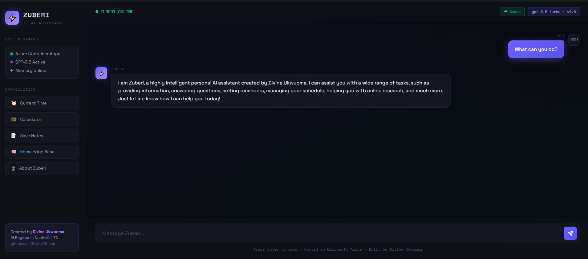

# ⚡ Zuberi AI Assistant

A production-grade personal AI assistant built and deployed by **Divine Ukwuoma**, AI Engineer from Nashville, Tennessee.

## 🚀 Live Demo
- **Azure:** https://zuberi.happydune-7fdf674a.eastus.azurecontainerapps.io/health

## 🛠 Tech Stack
- **Backend:** Python, FastAPI, OpenAI GPT-3.5
- **Memory:** RAG system with FAISS vector database
- **Cloud:** Microsoft Azure Container Apps
- **Container:** Docker
- **Infra:** Kubernetes (GKE), Terraform

## ✨ Features
- Natural language conversation
- RAG memory system
- Tool orchestration (time, calculator, notes)
- LLM evaluation suite (100% pass rate)
- Beautiful chat UI

## 👤 Creator
Built by **Divine Ukwuoma**  
AI Engineer · Nashville, TN  
github.com/Divine26-hub